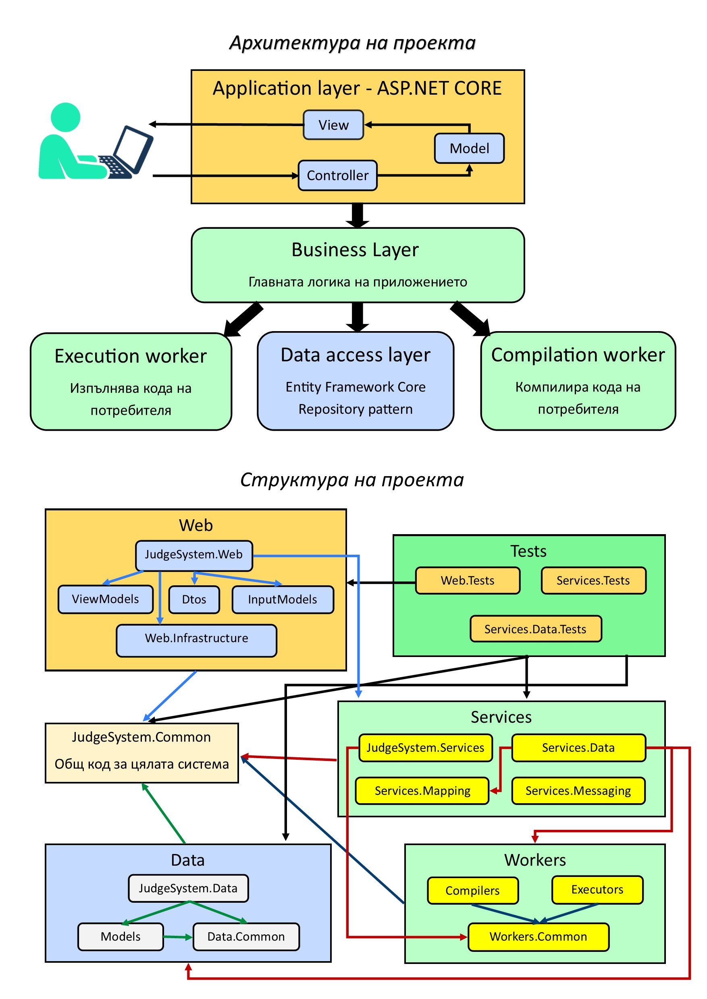
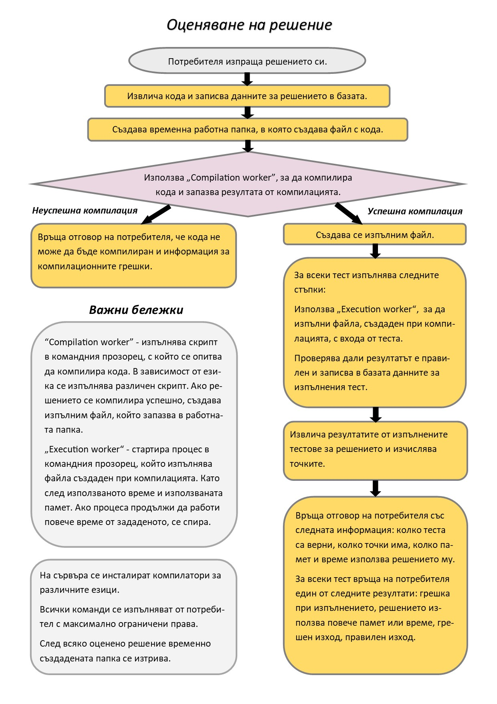

# Judge System
An open-source judge system for evaluating programmming code and managing tasks and competitions.
This was my final project for "C# MVC Frameworks - ASP.NET Core - June 2019" course in SoftUni.

[](https://dev.azure.com/nasko01vasilev/JudgeSystem/_build/latest?definitionId=2&branchName=master)

[](https://dev.azure.com/nasko01vasilev/JudgeSystem/_build/latest?definitionId=2&branchName=develop)

## Description
This is a judge system, similar to SoftUni judge but a bit more simple.
It can evaluate user's programming code automatically.
Aims of this platform are to be used in school. It can make work of our teachers more easier and also students will be
able to solve more problems and check their solutions faster. I beleive that using this application more students will become
passionate about programming and may become successfull developers one day.

## Documentation
You can find the documentation by navigation to the following path: Documentation/JudgeSystem - Documentation.docx.
Or if you prefer watching to reading. You can watch videos about the system.
* In [this](https://www.youtube.com/embed/FbM2rhNMFVs) video you can watch how users can work in the system.
* In [this](https://www.youtube.com/watch?v=JjZ8iy4g0K0) video you can watch how administrators can work in the system.

## Getting Started
### Prerequisites
You will need the following tools:

* [Visual Studio](https://www.visualstudio.com/downloads/)
* [Microsoft SQL Server](https://www.microsoft.com/en-us/sql-server/sql-server-downloads)
* [.NET Core SDK 2.2](https://www.microsoft.com/net/download/dotnet-core/2.2)

### Setup
Follow these steps to set up your development environmet:

  1. Clone the repository
  2. Create your own [Send Grid](https://sendgrid.com/) account or use existing one. Go to Settings/Api Keys and create new Api Key and then copy ApiKey Name and API Key ID.
  4. If you have some account in [Microsoft Azure](https://azure.microsoft.com/en-us/) create storge account. 
  If you do not want to create storage account in azure ```open StartUp.cs and commnent method ConfigureAzureBlobStorage```.
  You just will not be able to upload files.
  5. If you want to submit java code, install [JDK](https://www.microsoft.com/net/download/dotnet-core/2.2)
  6. Open JudgeSystem.sln file right click on JudgeSystem.Web -> Add -> New Item. In the search bar search for `app settings` and then add ```App Settings File```. Replce its content with the following one and then replcae each value which starts with ```your```.
     ```
     {
        "ConnectionStrings": {
          "DefaultConnection": "Server=your server name;Database=JudgeSystem;Trusted_Connection=True;MultipleActiveResultSets=true"
        },
        "Logging": {
            "IncludeScopes": false,
             "LogLevel": {
                  "Default": "Warning"
             }
          },
          "SendGrid": {
            "SendGridKey": "your API Key ID from SendGrid",
            "SendGridUser": "your ApiKey Name from Send Grid"
          },
          "AzureBlob": {
              "StorageConnectionString": "azure storage connection string",
              "AccountKey": " your azure storage api key",
              "AccountName": "yourazure storage acount name",
              "ContainerName": "your azure storage container name"
          },
          "Email": {
            "Name": "your first name",
            "Surname": "your last name",
            "Username": "your email"
          },
          "App": {
            "Name": "Judge System"
          },
          "Admin": {
            "Username": "your admin name",
            "Password": "your admin password",
            "Email": "your admin email",
            "Name": "your admin first name",
            "Surname": "your admin last name"
          },
          "Compilers": {
            "Java": "your path to javac.exe and java.exe. For exmaple C:\\Program Files\\Java\\jdk1.8.0_181\\bin",
            "CPlusPlus": "C:\\Users\\Nasko\\Desktop\\JudgeSystem\\Web\\JudgeSystem.Web\\wwwroot\\Compilers\\MinGW\\bin"
          }
      } 
       ```

  7. Open package manager console, choose as Defaut project: JudgeSystem.Data and run the following command: ```update-database```
  8. Press Ctrl + F5

## Technologies
* .NET Core 2.2
* ASP.NET Core 2.2
* ASP.NET Core MVC
* Entity Framework Core 2.2
* xUnit
* Automapper, SendGrid, jQuery, Bootstrap

## Project Architecture

* Data access layer - works with the database using Entity Franework Core 2.2, this layer is independent from the others. It consists of two other layers:
  * Domain Layer - contains all entities, enums. Classes which represent tables in the database
  * Persistence Layer - contains database context, all configurations, migrations and data seeding logic. It is responsible for data persistance. Here is implmented Repository desing pattern which help us to accomplish more abstraction between data access logic and business logic. As a result we can our database provider without making so many changes to the code. For example we can chnage MS SQL with MongoDB without changing some business logic.
* Business Layer - main logic of the appliaction. It depends only on Data access layer but it uses repositories to access data so the coupling is very loose. It can be reuced in multiple appliactions. For example if we want to create some mobile version of the system, can reuse logic in this layer and we should also implement the new user intreface.
* Application Layer - consists of those elements that are specific to this application. It do the binding between the application and your business layer. It depends on business layer. It uses specific technologies and conceptions like: ASP.NET CORE, Middlewares and others. In our situation it's main functionality is to receive the request and send response to the clients.
* Presentation Layer -  contains all presentation logic. It used Razor view engine to generate html and also use technologies like: JavaScript, jQuery, AJAX.
* Common Layer - contains all the logic which is shared in the application. Contains global constants, custom exceptions and extension methods.
* Workers - .NET Standard class libraries which contains some more complicated logic. They are used by the business layer in order to keep the code simple there. The most compilacted logic in the appllication is related to complication and execution of submissions. So this logic is implemented here in two differnet projects.
* Tests - the system is tested with a lot of automated tests - unit tests and integration tests. We use libraries like Moq, xUnit and Microsoft.EntityFrameworkCore.InMemory to the all the logic in business layer.
* Code quality - project follows SOLID principles and all other principles of high quality code. Also there are ```.editorconfig``` file in which are defained all code styles and conventions in order the code of the project to be consistent.

## Functionality
### Guest Users
 - Login, Register
 - View all courses and lessons in this course
 - View home page with all active and previous contests
 
### Logged in Users
 - Submit solution and receive instant responese about how many points he has received
 - Submit solutions only in practice mode
 - Activate student profile using special activation key
 - View information about error, which occurs during excecution only of trial tests
 - View input and output data only of trial tests
 - Cannot view information about error, which occurs during excecution of official test
 - View execution result of tests
 - View their practice results
 - Download resources
 
 ## Users in role "Student"
  - All the functionalities of logged in user
  - Take part of competitions(Send solutions in compete mode)
  - Take part in exam and receive grade
  - Informtion about all passed exams is available in their profile
  - Participate in all contests available in the home page
  - View their compete and practice results
 
### Administrators(Teachers in school)
 - Add student profile to the system
 - Create, edit and delete course (Each course combines some lectures)
 - Create, edit and delete lectures
 - Have access to all contests' results
 - Filter contests' results by username, student class, contest start and end time etc.
 - Create contest for specific lecture with start and end time
 - Edit and delete contests
 - Create, delete and edit problem for specific lecture
 - Add, edit and delete resources for specific lecture
 - Create, edit and delete test for specific problem
 - View input and output data of each tests
 - View information about error, which occurs during excecution of some test

## Breif description of main functionalities
### Student profile
 - When student profile is added to the database, activation key is automatically generated, that is sent to the student's email
 - When the user enter this activation key, he becomes student and role "Student" is added to his roles
 - In this way he obtain full name, student email, number in class, name of class and some other privileges
 
 ### Submissions
  - If there is compile time error, the user can see what is the error
  - If solution is compiled successfully, all tests for this problem are executed over this solution
  - Execution results of tests are: (Success, Run time error, Memory limit, Time limit).
  - User can receive points in range 0 to problem's max points for his solution
  - The system finds user's best solution when process contests' results
  
  ### Lectures
  - Each lecture can be one of the tree types(Homework, Exercise or Exam)
  - Lecture can be added with some password which is really convenient for exam lecture
  ## Submission evaluation workflow
  
